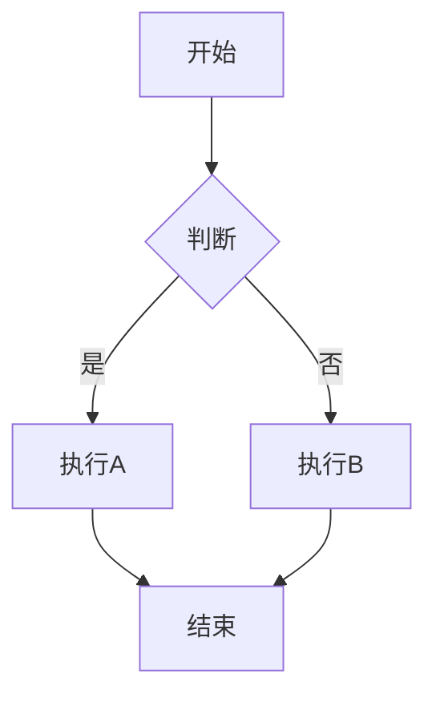
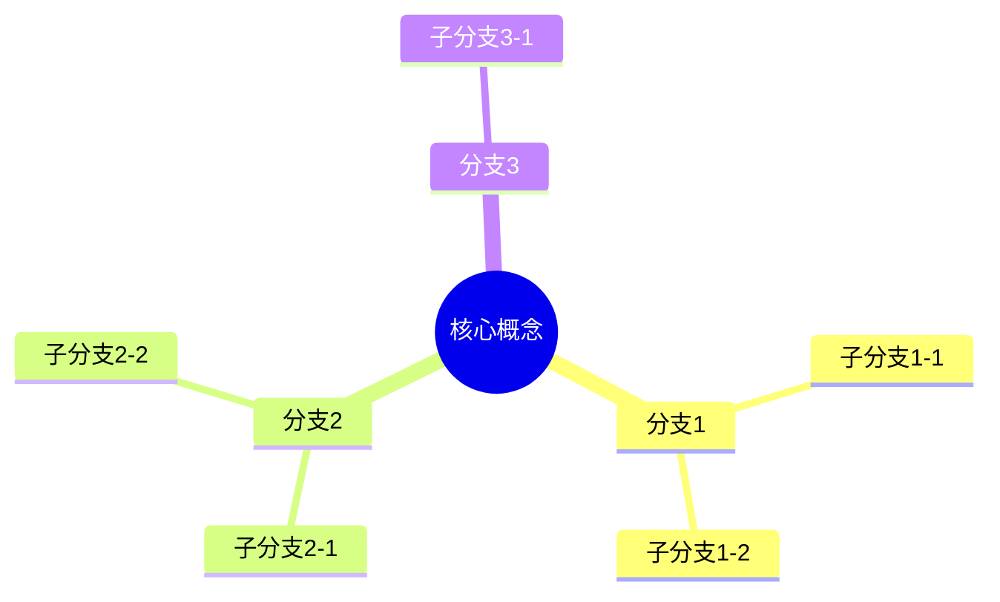
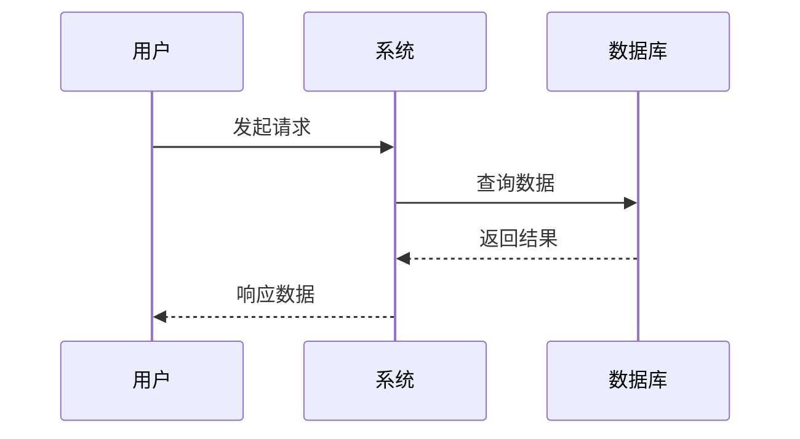
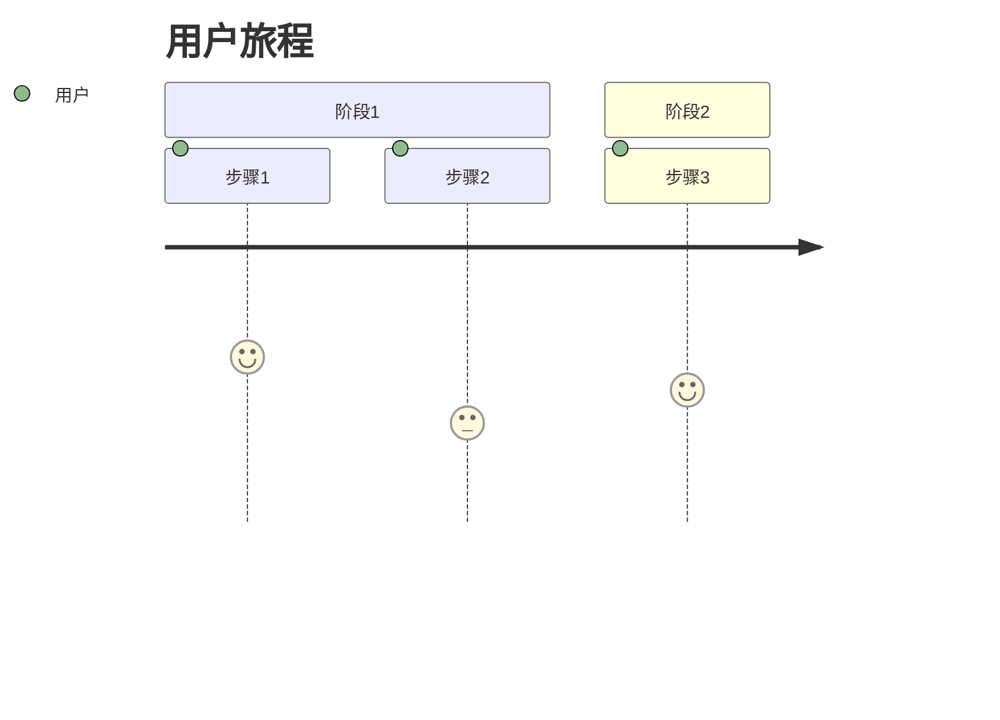
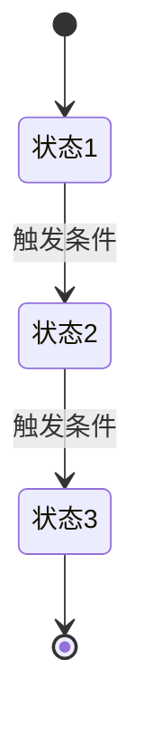
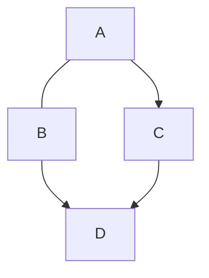
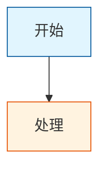
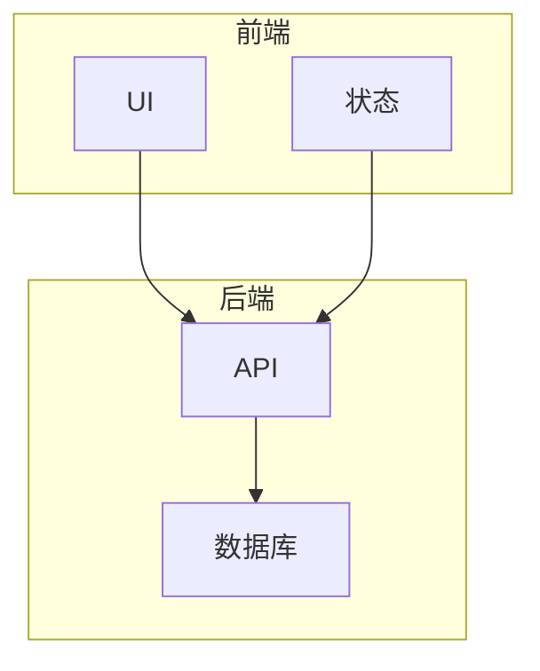
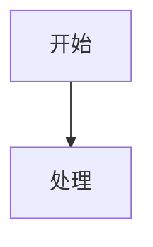

# Mermaid 图表模式参考

本文档提供常用 Mermaid 图表类型的语法模板和样式建议。

---

## 1. Flowchart（流程图）⭐ 最常用

### 适用场景
- 流程、步骤、因果关系
- 决策树、分支逻辑
- 系统架构、模块关系

### 基础语法

### 方向选项
- `TD` / `TB`：从上到下
- `LR`：从左到右
- `RL`：从右到左
- `BT`：从下到上

### 节点形状

| 语法 | 形状 | 适用场景 |
|------|------|---------|
| `A["文本"]` | 方框 | 普通节点 |
| `A("文本")` | 圆角 | 开始/结束 |
| `A{"文本"}` | 菱形 | 判断/决策 |
| `A(("文本"))` | 圆形 | 关键点 |
| `A[["文本"]]` | 子程序 | 子流程 |
| `A[("文本")]` | 圆柱 | 数据库 |

### 连接线样式

| 语法 | 样式 |
|------|------|
| `-->` | 实线箭头 |
| `---` | 实线无箭头 |
| `-.->` | 虚线箭头 |
| `==>` | 粗线箭头 |
| `--文本-->` | 带文字 |

---

## 2. Mindmap（思维导图）

### 适用场景
- 层级关系、知识展开
- 概念拆解、头脑风暴
- 分类归纳

### 基础语法

**注意**：mindmap 不支持 classDef 样式和 emoji 渲染可能有限制。

---

## 3. Sequence Diagram（时序图）

### 适用场景
- 多方交互、通信流程
- API 调用链
- 用户操作流程

### 基础语法

### 箭头类型

| 语法 | 样式 |
|------|------|
| `->>` | 实线箭头 |
| `-->>` | 虚线箭头 |
| `-)` | 异步 |
| `--x` | 失败 |

---

## 4. Journey（用户旅程）

### 适用场景
- 用户故事、体验流程
- 故事线、时间线
- 情感变化

### 基础语法

**注意**：journey 不支持 classDef 样式。

---

## 5. State Diagram（状态图）

### 适用场景
- 状态机、生命周期
- 对象状态变化
- 条件分支

### 基础语法

---

## 6. Graph（关系图）

### 适用场景
- 网络关系、依赖图
- 复杂关联
- 组织结构

### 基础语法

---

## 样式技巧

### classDef 定义

### subgraph 分组

### 注释

---

## 结构类型与图表选择

| 结构类型 | 特征 | 推荐图表 |
|---------|------|---------|
| 流程型 | 有步骤、有顺序 | flowchart |
| 层级型 | 有分类、有上下级 | mindmap |
| 关系型 | 有连接、有交互 | flowchart / sequenceDiagram |
| 对比型 | 有不同方案/选项 | flowchart（并列） |
| 时序型 | 有时间线、有阶段 | journey / sequenceDiagram |
| 状态型 | 有状态变化、生命周期 | stateDiagram-v2 |
| 网络型 | 多对多关联 | graph |

---

## 常见错误

1. **中文节点不加引号**
   - ❌ `A[中文节点] --> B`
   - ✅ `A["中文节点"] --> B`

2. **emoji 后面没空格**
   - ❌ `A["开始🚀"]`
   - ✅ `A["开始 🚀"]`

3. **特殊字符未转义**
   - ✅ `A["包含#号的文本"]`

4. **classDef 名称含中文或空格**
   - ❌ `classDef 颜色1 fill:...`
   - ✅ `classDef warm1 fill:...`

5. **节点 ID 重复**
   - 即使在不同 subgraph 中，ID 也必须全局唯一

6. **mindmap/journey 使用 classDef**
   - 这两种类型不支持样式类定义
