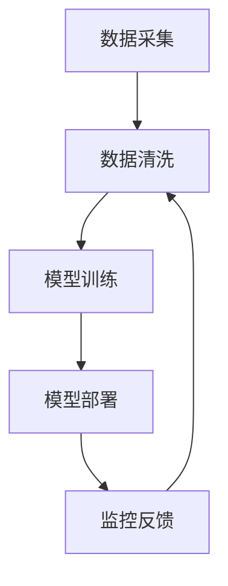
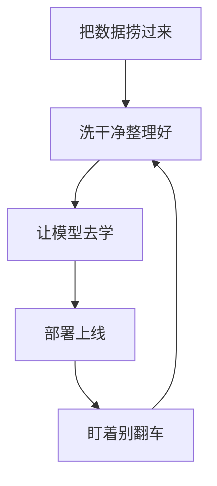
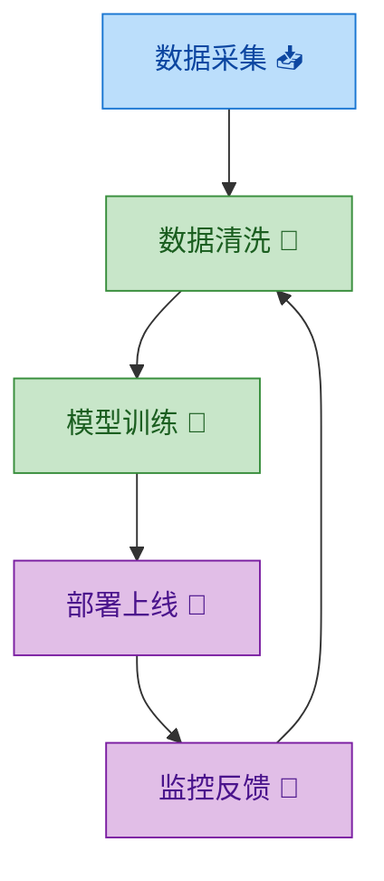
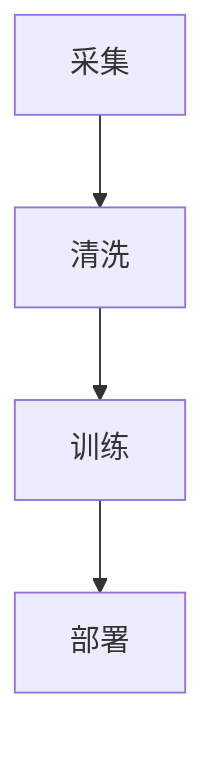
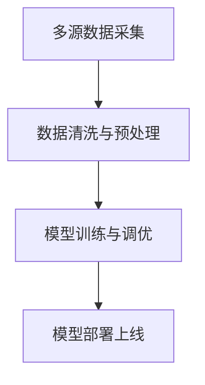
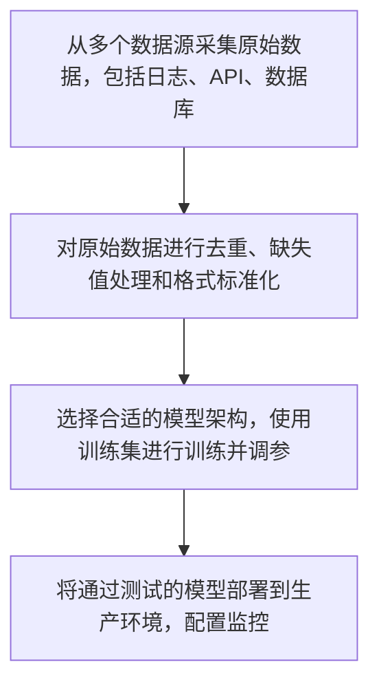

# Mermaid 样式指南 — 参数到 Mermaid 的完整映射

本文档定义了五个参数如何具体影响 Mermaid 图解的生成。Phase 5 生成时加载此文件。

---

## 1. 炫酷程度（Coolness Level）

### L1 — 纯文字

没有任何装饰，纯粹的文本节点。

**规则**：
- 节点标签：纯文本，无 emoji
- classDef：不生成任何样式类
- subgraph：仅用纯文本标题，无 emoji
- 连接标签：纯文本

**示例**：


### L2 — 活人感

自然口语化的表达，偶尔在标题用 emoji。没有色彩样式。

**规则**：
- 节点标签：口语化的自然语言
- emoji：仅在图表标题和 subgraph 标题上使用
- classDef：不生成
- 连接标签：可以用口语化文字

**示例**：


### L3 — 中等（emoji + 色彩）

关键节点带 emoji，2-3 个 classDef 提供色彩。

**规则**：
- emoji：标题 + 关键节点（不超过 50% 的节点）
- classDef：定义 2-3 个命名颜色类
- subgraph：标题带 emoji
- 连接标签：简短文字，关键连接可带 emoji
- 应用配色方案的 hex 值

**示例**：


### L4 — 炫酷（丰富 emoji + 配色）

几乎每个节点都有 emoji，4+ 个 classDef，丰富的视觉层次。

**规则**：
- emoji：几乎所有节点和连接标签
- classDef：4+ 个命名颜色类，覆盖所有节点
- subgraph：标题带 emoji + 背景色
- 连接标签：带 emoji 的描述性文字
- 视觉密度最大化

**示例**：
```mermaid
flowchart TD
    subgraph 数据层 🗄️
        A["数据采集 📥"] --> B["数据清洗 🧹"]
        B --> C["特征工程 ⚙️"]
    end
    subgraph 模型层 🤖
        D["模型训练 🧠"] --> E["超参调优 🎯"]
        E --> F["模型评估 📊"]
    end
    subgraph 部署层 🚀
        G["部署上线 🔥"] --> H["监控告警 🔔"]
        H --> I["持续优化 ♻️"]
    end

    C --> D
    F --> G
    I --> A

    classDef data fill:#BBDEFB,stroke:#1976D2,color:#0D47A1
    classDef model fill:#C8E6C9,stroke:#388E3C,color:#1B5E20
    classDef deploy fill:#FFCDD2,stroke:#C62828,color:#B71C1C
    classDef core fill:#FFE0B2,stroke:#E65100,color:#BF360C

    class A,B,C data
    class D,E,F model
    class G,H,I deploy
    class F core
```

---

## 2. 配色方案（Color Palette）

仅在炫酷程度 >= L3 时生效。L1/L2 忽略配色参数（不会生成 classDef）。

### 暖色系 🌅

```mermaid
classDef warm1 fill:#FFCDD2,stroke:#C62828,color:#B71C1C
classDef warm2 fill:#FFE0B2,stroke:#E65100,color:#BF360C
classDef warm3 fill:#FFF9C4,stroke:#F9A825,color:#F57F17
classDef warm4 fill:#FFCCBC,stroke:#D84315,color:#BF360C
classDef warm5 fill:#F8BBD0,stroke:#AD1457,color:#880E4F
```

适合：生活类、消费类、情感类话题

### 冷色系 🌊

```mermaid
classDef cool1 fill:#BBDEFB,stroke:#1976D2,color:#0D47A1
classDef cool2 fill:#C8E6C9,stroke:#388E3C,color:#1B5E20
classDef cool3 fill:#E1BEE7,stroke:#7B1FA2,color:#4A148C
classDef cool4 fill:#B2DFDB,stroke:#00695C,color:#004D40
classDef cool5 fill:#B3E5FC,stroke:#0277BD,color:#01579B
```

适合：技术类、架构类、逻辑推理话题

### 彩虹渐变 🌈

按节点顺序循环使用：
```mermaid
classDef rainbow1 fill:#FFCDD2,stroke:#E53935,color:#B71C1C
classDef rainbow2 fill:#FFE0B2,stroke:#FB8C00,color:#E65100
classDef rainbow3 fill:#FFF9C4,stroke:#FDD835,color:#F57F17
classDef rainbow4 fill:#C8E6C9,stroke:#43A047,color:#1B5E20
classDef rainbow5 fill:#BBDEFB,stroke:#1E88E5,color:#0D47A1
classDef rainbow6 fill:#E1BEE7,stroke:#8E24AA,color:#4A148C
```

适合：创意类、多维度对比、需要视觉冲击的话题

### 黑白极简 ⬛

```mermaid
classDef mono1 fill:#F5F5F5,stroke:#9E9E9E,color:#212121
classDef mono2 fill:#E0E0E0,stroke:#757575,color:#212121
classDef mono3 fill:#BDBDBD,stroke:#616161,color:#212121
```

适合：学术、严肃、商务话题

---

## 3. 简洁程度（Conciseness）

### 低（每节点 < 20 字）

节点标签仅 1-3 个词，极度精简。



- 不生成任何说明文字
- 图解自解释
- 适合：快速概览、内行读者

### 中（每节点 20-40 字）

短短语 + 简要上下文。



- 每张图下可有 1-2 句概括
- 适合：通用场景（默认）

### 高（每节点 40+ 字）

完整描述，可包含具体说明。



- 每张图下可附带详细说明段落
- 适合：教学、文档、入门受众

**说人话说明长度对照**：
| 简洁程度 | 说明文字 |
|---------|---------|
| 低 | 不写说明 |
| 中 | 1-2 句话概括 |
| 高 | 一段完整说明 |

---

## 4. 目标受众（Audience）

### 入门

**词汇规则**：避免专业术语，用日常类比替代。

| 术语 | 替换为 |
|------|--------|
| API | 接口 |
| 并发 | 同时处理 |
| 微服务 | 小模块 |
| 容器化 | 打包运行 |
| CI/CD | 自动部署 |
| 缓存 | 快取 |
| 负载均衡 | 分流 |
| 数据库索引 | 目录 |

**节点命名**：用比喻和日常用语
- ❌ "API Gateway 路由请求"
- ✅ "调度员把活分给不同的人"

### 进阶

**词汇规则**：标准技术词汇，不简化也不过度堆砌。

- 保留常用术语（API、模型、数据库）
- 避免过于小众的缩写
- 适度解释复杂概念

### 专业

**词汇规则**：追求精确，使用领域术语。

- 保留所有专业术语
- 使用英文术语也可以
- 追求信息密度
- 简洁优先

---

## 5. 生成数量策略（Diagram Count）

### 精简（0-6 张）

只画最核心的结构。优先级：
1. 总览图（1张）
2. 核心流程/关系（2-3张）
3. 关键对比（1张，如果有的话）

合并策略：将次要概念合并到主图中，不单独拆图。

### 标准（6-10 张）

全面覆盖主要结构。每类结构至少一张图：
1. 总览图（1张）
2. 每个核心组件的详细图（2-4张）
3. 流程图（1-2张）
4. 对比/关系图（1-2张）
5. 补充说明图（1-2张）

### 详细（10-15 张）

深入展开每个概念。多角度呈现：
1. 总览图（1张）
2. 每个核心组件的详细图（4-6张）
3. 多种视角的流程图（2-3张）
4. 对比图（1-2张）
5. 边界情况/异常流程（1-2张）
6. 演进/时间线（1-2张）

### 超详细（15+ 张）

穷尽式可视化。每个提取到的概念至少一张图：
1. 总览图（1张）
2. 每个核心组件的多角度图（6-8张）
3. 完整流程链（3-4张）
4. 全面对比矩阵（2-3张）
5. 异常/边界场景（2-3张）
6. 时间线/演进（1-2张）
7. 综合总结图（1张）

---

## 6. 参数冲突处理

当参数组合产生矛盾时，按以下规则处理：

| 冲突 | 解决方案 |
|------|---------|
| L1 炫酷 + 非 B&W 配色 | 配色无效，不生成 classDef。提示用户升级到 L3+ |
| L4 炫酷 + 低简洁 | emoji 丰富但文字精简。L4 控制视觉装饰，低简洁控制文字量，两者独立生效 |
| 入门受众 + 高简洁 | 允许较长文字用于解释概念。受众控制词汇难度，简洁控制字数，可以长但用简单词 |
| 精简数量 + L4 炫酷 | 图少但每张都很炫。数量和炫酷独立生效 |
| 专业受众 + 低简洁 | 极简但用专业术语。每张图信息密度极高 |

---

## 7. Mermaid 语法正确性规则

生成任何图解时必须遵守：

1. **中文文本必须用引号包裹**：`A["中文文本"]` 而不是 `A[中文文本]`
2. **emoji 前后加空格**：`A["开始 🚀"]` 而不是 `A["开始🚀"]`
3. **特殊字符转义**：`#` `&` `<` `>` 等必须用引号包裹
4. **classDef 名称不能含中文或空格**：用英文命名如 `warm1` `processNode`
5. **class 引用必须匹配 classDef 定义的名称**
6. **subgraph 嵌套最多 2 层**：避免渲染异常
7. **节点 ID 不可重复**：跨 subgraph 的 ID 也必须唯一
8. **mindmap 不支持 classDef**：mindmap 类型忽略配色方案
9. **journey 不支持 classDef**：journey 类型忽略配色方案
